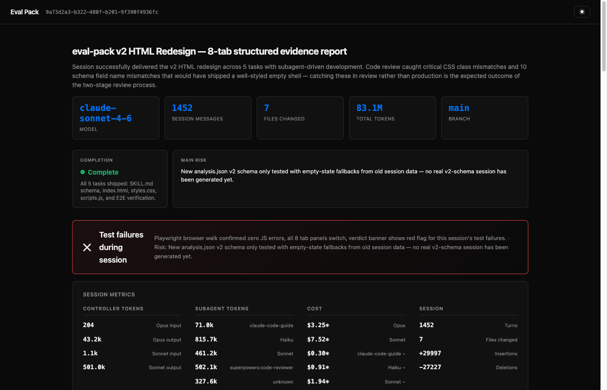
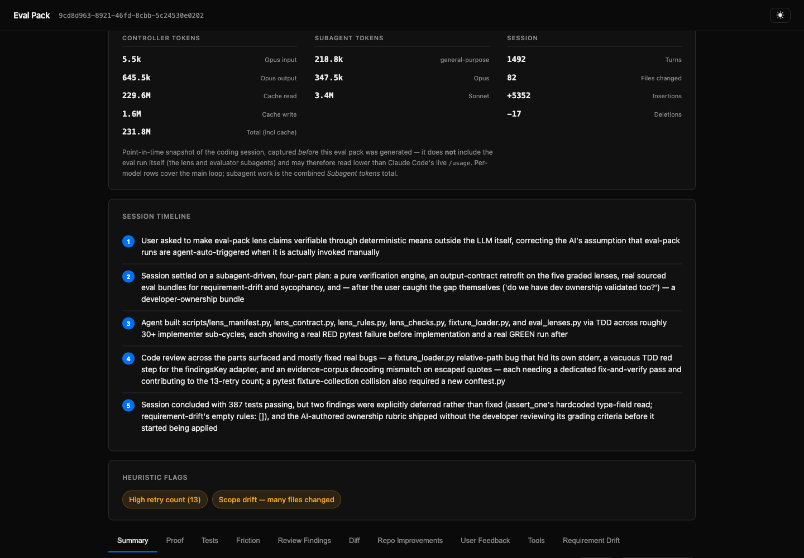
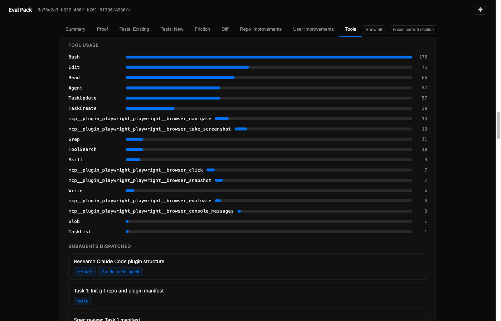

# eval-pack

A Claude Code plugin that generates eval packs — polished HTML reports capturing how AI-assisted code was produced. Designed for PR review workflows where reviewers need visibility into agent behavior, not just the diff.

## Screenshots







## What's in an Eval Pack?

- **Verdict banner** — pass/fail based on agent-driven test results
- **Visual evidence** — screenshots from Playwright or browser verification
- **Session metrics** — per-model token breakdown (controller + subagents), API cost estimate, turns, files changed
- **Session timeline** — human-readable narrative of what happened during the session
- **Heuristic flags** — false completions, retries, scope drift, test failures
- **Claude analysis** — retrospective, repo friction report, prompt quality assessment
- **Tools tab** — tool usage bar chart, subagents dispatched with model tags, skills leveraged
- **Full transcript** — collapsible conversation history with syntax highlighting
- **Iteration rounds** — compare multiple runs side by side

## Requirements

- **Python 3** — required by the generation scripts (`extract_metrics.py`, `detect_patterns.py`, `extract_tools.py`, `render_html.py`); JSON parsing and zip packaging use the Python standard library, so no extra CLI tools are needed
- **gh** CLI — required by `/eval-pack:review` to create PRs and post comments

## Install

In Claude Code, run:

```
/plugin marketplace add smalls257/eval-pack
/plugin install eval-pack@eval-pack
```

Then run the setup skill to wire up the gitignore:

```
/eval-pack:setup
```

### Distribute to your team

To distribute the marketplace config to everyone who clones your repo, commit `.claude/settings.json` with:

```json
{
  "extraKnownMarketplaces": {
    "eval-pack": {
      "source": {
        "source": "github",
        "repo": "smalls257/eval-pack"
      }
    }
  }
}
```

Each dev still needs to run `/plugin marketplace add smalls257/eval-pack` and `/plugin install eval-pack@eval-pack` once to install the plugin.

## Usage

### Generate an eval pack

```
/eval-pack:generate
```

Produces a self-contained zip in `.eval-packs/<session-id>.zip`. Extract and open `index.html` in a browser.

### Generate + create PR

```
/eval-pack:review
```

Generates the eval pack, commits the zip to the current branch, and creates (or updates) a PR.

### Agent auto-generation

Agents can invoke `/eval-pack:generate` autonomously when they judge work is PR-ready. No hooks required — the agent calls the skill like any other.

## Configuration

eval-pack is configured per-repo via `.eval-pack.json` (committed) and `.eval-pack.local.json`
(gitignored, per-developer). Layering, lowest to highest: bundled defaults < `extends` presets <
`.eval-pack.json` < `.eval-pack.local.json` < `CLAUDE_PLUGIN_OPTION_*` env. Validation is
fail-loud: an unknown key, bad type, bad regex, or missing referenced file halts generation with
a precise error. Run `/eval-pack:setup` for a guided start.

```json
{
  "$schema": "./.eval-pack.schema.json",
  "testCommands": ["npm test"],
  "ticketPattern": "ACME-\\d+",
  "analysisStance": "collaborative-coach",
  "rubric": {
    "ship": "All acceptance criteria demonstrated with test output",
    "hold": "Any claim of success without observed evidence"
  },
  "retrospectiveQuestions": ["What slowed the session down the most?"],
  "redaction": ["sk-[A-Za-z0-9]+"],
  "flagSeverities": {"scopeDrift": "off"},
  "costBudgetTokens": 50000000,
  "brandName": "Acme Eval", "subjectNoun": "service", "defaultTheme": "light",
  "templateDir": "eval-theme",
  "analysisLenses": [{"skill": "acme-security-lens", "role": "scorer"}],
  "verdictAggregation": "min"
}
```

Env values (`CLAUDE_PLUGIN_OPTION_<key>`) that start with `[` or `{` are parsed as JSON — the
only way to express a dict, or a list element containing a comma (a regex like `secret{1,3}`, for
example); `redaction` in particular REQUIRES the JSON form once a pattern has a comma. Any other
list value uses comma shorthand for simple tokens (`"a,b,c"`). File-layer lists (`.eval-pack.json`
/ `.eval-pack.local.json`) ADD to the defaults; start a list with `"!replace"` to replace them
instead (e.g. `["!replace", "ci-flake", "review-latency"]`) — a leading `"!replace"` in an env
JSON list is honored the same way.

Key groups (full key list + types: `schema/eval-pack.schema.json`):
- **Evaluation prompts** — `analysisStance` (bundled: skeptical-reviewer, collaborative-coach,
  compliance-auditor; or your own at `.eval-pack/stances/<name>.md`), `rubric` (band → criteria;
  the evaluator must name the band it applied, and a validator rejects unknown bands),
  `retrospectiveQuestions` (each must be answered — validated), `frictionCategories` (the
  taxonomy `frictionLog` entries must draw from — validated), `evaluatorPromptFile` (extra
  grading guidance from a file in your repo). These gates are enforced by
  `scripts/validate_contracts.py`, not by prose: a violation halts the pipeline before render.
- **Heuristics** — `detectionPatterns` (regex lists; start a list with `"!replace"` to replace
  defaults instead of adding), `falseCompletionWindow`, `scopeDriftFileThreshold`,
  `retryAmberThreshold`, `flagSeverities` (retune or `"off"` any flag by id), `costBudgetTokens`,
  `customDetectors` and `detectorScripts` (your own deterministic policy checks — see below).
- **Tests & tickets** — `testCommands` (run verbatim; real exit codes drive the verdict, enforced
  by a validator), `ticketPattern`, `ticketBaseUrl`.
- **Security** — `redaction` (regexes masked in every emitted artifact, keys and values, before
  escaping), `publishOpenable`, `openableDir`.
- **Report** — `brandName`, `reportTitle`, `footerText`, `subjectNoun`, `defaultTheme`,
  `sections`, `messages`, `templateDir` (project dir overriding index.html/styles.css/scripts.js
  per-file), `zipNameTemplate`, `commitUrlTemplate`, `repoBaseUrl`.
- **Pipeline** — `outputDir`, `analysis`, `includeTranscript`.

`pythonExecutable` stays a plugin option in `.claude/settings.json` (`pluginConfigs.eval-pack.options`)
rather than moving into `.eval-pack.json` — it has to resolve before any script, including the
config resolver itself, can run.

### Extension lenses — your own analyses and scores

A lens is YOUR agent that runs during evaluation. Declare it:

```json
{ "analysisLenses": [{ "skill": "acme-security-lens", "role": "scorer" }],
  "verdictAggregation": "min" }
```

and provide an agent by that name (e.g. `.claude/agents/acme-security-lens.md` in your repo). It
receives PACK_DIR / REPO_ROOT / DIFF_BASE and must write `PACK_DIR/lenses/acme-security-lens.json`:

- **scorer** (influences the verdict via `verdictAggregation`):
  `{"skill": "acme-security-lens", "role": "scorer", "score": 61, "rationale": "one sentence",
    "findings": [{"type": "issue", "detail": "..."}]}`
- **contributor** (adds an attributed report section, never touches the score):
  `{"skill": "...", "role": "contributor", "title": "Section title", "findings": ["...", "..."]}`

Guarantees, enforced by code: a configured lens that produces no output becomes a red
"Lens failed" flag (it cannot silently vanish); scorer scores are clamped to 0–100 and reach the
verdict banner and confidence card only through your declared aggregation rule; a failing lens
never crashes the eval. Bundled examples: `requirement-drift`, `verification-rigor`.

### Custom detectors — your own deterministic policy checks

No LLM involved: a detector is a regex policy (`customDetectors`) or your own script
(`detectorScripts`) run over the recorded session, feeding the same gated flags→verdict pipeline.

```json
{ "customDetectors": [
    { "id": "sudoUsed", "level": "red", "label": "sudo executed", "scope": "bash", "pattern": "\\bsudo\\b" },
    { "id": "envRead", "level": "amber", "label": ".env accessed", "scope": "files", "pattern": "\\.env$" }
  ],
  "detectorScripts": ["eval-detectors/compliance.py"] }
```

Scopes: `bash` (commands), `files` (paths), `text` (assistant), `user` (your prompts). A script
must print ONLY its JSON result on stdout — `{"flags": [{"id", "level", "label"}]}` — nothing
else; a stray debug `print()` before or after it makes the output unparsable and the whole run a
red "Detector script failed" flag. Scripts are run with the plugin's own Python interpreter
(`sys.executable`), so `detectorScripts` entries must be Python. Either way — malformed output or
a nonzero exit — becomes that same red flag; it can't vanish silently.

### Tuning your eval — the loop

1. Edit `.eval-pack.json` (rubric, stance, detectors, lenses, thresholds…).
2. Instant check: `python3 <plugin>/scripts/resolve_config.py . --check` — a bad key/regex/band
   halts here, not mid-run (or just run step 3; it validates first).
3. `/eval-pack:tune` — re-evaluates the latest pack with your new config in minutes: recorded
   facts (transcript, metrics, tests) are reused; only patterns, the evaluator, lenses, and the
   report re-run. Each tune appends a **round**, so the report shows your before/after.
4. Ship the config that produces the eval you trust; it's committed with the repo, so the whole
   team gets it.

## How It Works

1. Dev (or agent) runs `/eval-pack:generate`
2. Scripts extract metrics and detect heuristic patterns from the transcript
3. Claude runs appropriate tests, captures screenshots and logs
4. Claude analyzes the session — retrospective, repo friction, prompt quality
5. HTML report is rendered with all data, zipped to `.eval-packs/<session-id>.zip`
6. `/eval-pack:review` commits the zip to the branch and creates a PR
7. Reviewer downloads zip from the branch, extracts, opens `index.html`

## Output

`/eval-pack:generate` writes a portable `.zip` into your `outputDir` (default `.eval-packs/`)
**and** an uncompressed, openable copy into your system temp directory. The command prints an
`Open: file://…/index.html` path — open it directly in a browser, no unzip required. The zip is
what `/eval-pack:review` commits to a PR branch.

The analysis is written by an independent `eval-pack-evaluator` sub-agent, not by the agent that
did the work, so the evaluation is not self-graded. When the `analysis` option is `false`, the
pack renders an explicit "analysis disabled" banner instead of an AI evaluation.

## Ticket linking

`/eval-pack:review` adds a `## Ticket` reference to the PR body. It auto-detects a ticket key
matching `[A-Z][A-Z0-9]+-[0-9]+` (e.g. `PROJ-123`) from the branch name or this branch's commit
messages; if none is found it asks once (answer with a key, a full URL, or `none`). Set
`ticketBaseUrl` to render detected keys as clickable links. The reference is added when the PR is
first created.

## License

MIT
